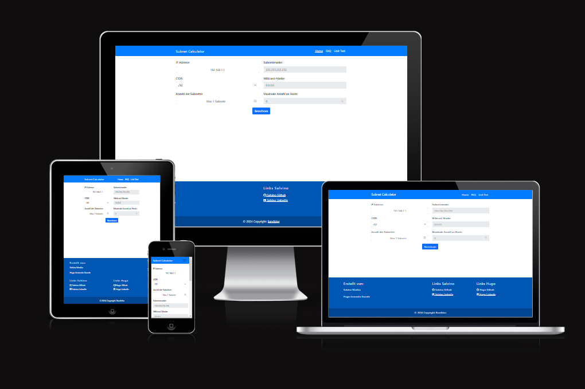

## Einführung

"Ipv-4 Subnetzrechner" ist eine Website eines fiktiven Technologieunternehmens, die speziell dafür entwickelt wurde, die Berechnung von IPv4-Subnetzen zu erleichtern. Die Plattform ermöglicht es Benutzern, effizient IPv4-Adressen und deren Subnetze zu analysieren und zu berechnen, was besonders nützlich für Netzwerkadministratoren und IT-Profis ist.

Diese Anwendung zielt darauf ab, eine benutzerfreundliche Schnittstelle zu bieten, über die Benutzer schnell Subnetzinformationen wie Netzwerkadressen, Broadcast-Adressen, nutzbare IP-Bereiche und mehr generieren können. Funktionen zur Validierung von IP-Adressen und CIDR-Notationen sind integriert, um die Genauigkeit der Ergebnisse zu gewährleisten.

Die "Tech Nova" IPv4 Subnetzrechner-Website ist bereits live und kann über den folgenden Link erreicht werden: [IPv4 Subnetzrechner von Tech Nova](https://salmod91.github.io/Ipv4-Rechner/)

## Inhaltsverzeichnis
- [Einführung](#Einführung)
- [Benutzererfahrung (UX)](#ux)
    - [Umfang & Strategie](#umfang--strategie)
        - [Projektzweck](#projektzweck)
        - [Projektziel](#projektziel)
        - [Zielgruppe](#zielgruppe)
        - [Kommunikation](#kommunikation)
        - [Ziele der aktuellen Benutzer](#ziele-der-aktuellen-benutzer)
        - [Ziele der neue Benutzer](#ziele-neuer-benutzer)
        - [User Stories](#user-stories)
    - [Struktur](#struktur)

## Benutzererfahrung (UX)

### Umfang & Strategie

Click to expand

#### Projektzweck
Die Website „IPv4 Subnetzrechner“ zielt darauf ab, Benutzern ein umfassendes Werkzeug zur Verfügung zu stellen, um IPv4-Subnetze effizient zu berechnen und zu analysieren. Sie bietet wesentliche Informationen über Netzwerkkonfigurationen, wie Netzwerkadressen, Broadcast-Adressen, nutzbare IP-Bereiche und mehr, in einer interaktiven Art und Weise. Benutzer können durch einfaches Auswählen von CIDR-Notationen und Eingabe von IP-Adressen sofort detaillierte Ergebnisse erhalten.

#### Projektziel
Entwickeln einer Website, die Nutzern eine intuitive und informative Benutzeroberfläche zur Berechnung von IPv4-Subnetzen bietet.

#### Zielgruppe
Die Zielgruppe des „IPv4 Subnetzrechners“ umfasst vor allem Netzwerkadministratoren und IT-Profis, die eine präzise und effiziente Werkzeug zur Analyse und Berechnung von IPv4-Subnetzen benötigen. Dies schließt sowohl Technikbegeisterte ein, die ein tieferes Verständnis für Netzwerkstrukturen suchen, als auch Fachleute in Unternehmen, die täglich mit der Planung und Optimierung von Netzwerkinfrastrukturen betraut sind.

#### Kommunikation
Die Website ist so strukturiert, dass Benutzer bei ihrer Ankunft sofort eine klare und zugängliche Übersicht über das Angebot der Seite erhalten, ohne von zu vielen Informationen überwältigt zu werden. Die Startseite fasst effektiv die Schlüsselbereiche und potenziellen Gründe für Ihren Besuch zusammen, was von Beginn an ein nahtloses Navigationserlebnis ermöglicht.

#### Ziele der aktuellen Benutzer
- Dass die Besucher stets über die Netzwerkkonfigurationsmöglichkeiten auf dem Laufenden gehalten werden.
- Den Administratoren eine benutzerfreundliche Schnittstelle bereitzustellen, um Netzwerkeinstellungen und -konfigurationen zu aktualisieren.

#### Ziele neuer Benutzer
- Die Seite leicht navigieren zu können und die bereitgestellten Informationen klar zu verstehen.
- Neue Benutzer über die Funktionen und den Zweck des IPv4-Rechners zu informieren.

#### User Stories

### Struktur

Click to expand

